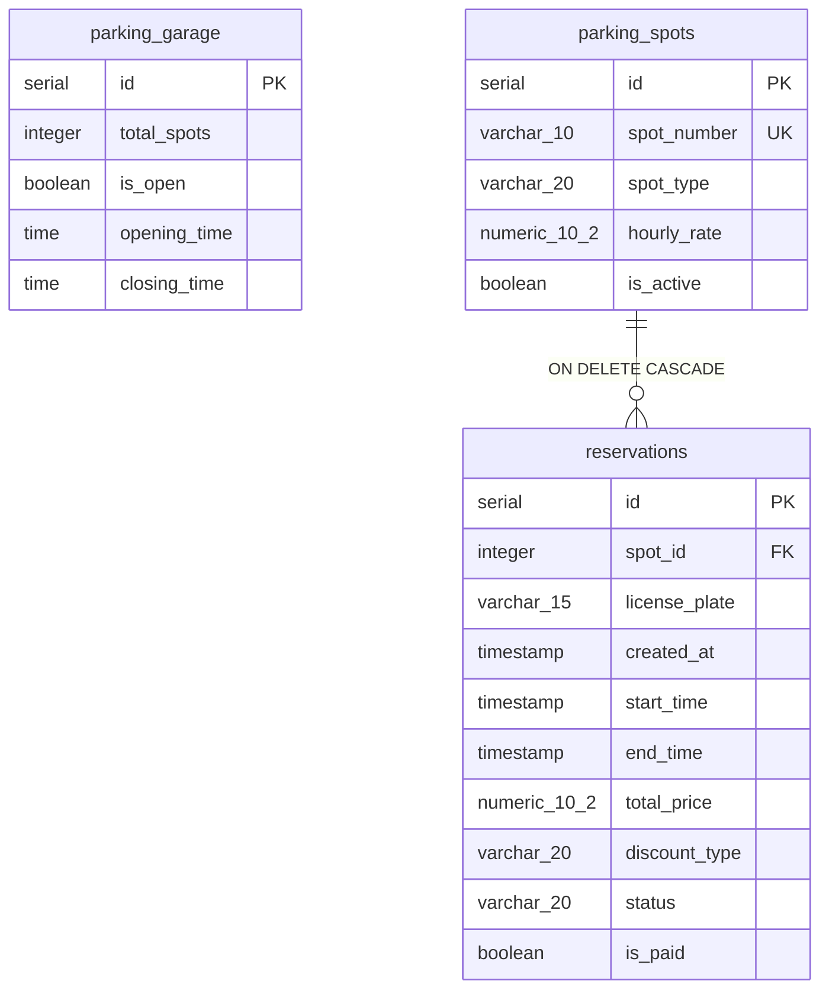

# Rendszerterv

**Parkolóhely-foglaló rendszer** — React + PHP + PostgreSQL, Docker Compose alatt.

---

## Tartalom

- [1. Architektúra](#1-architektúra)
- [2. Adatmodell](#2-adatmodell)
- [3. Versenyhelyzetek és a dupla foglalás kizárása](#3-versenyhelyzetek-és-a-dupla-foglalás-kizárása)
- [4. Teljesítmény és indexelés](#4-teljesítmény-és-indexelés)
- [5. Üzleti szabályok](#5-üzleti-szabályok)
- [6. API-felület](#6-api-felület)
- [7. Hibakezelés](#7-hibakezelés)
- [8. Tesztelési stratégia](#8-tesztelési-stratégia)
- [9. Ismert korlátok](#9-ismert-korlátok)

---

## 1. Architektúra

A rendszer három, egymástól függetlenül újraépíthető konténerből áll, amelyeket a
`docker-compose.yaml` fog össze.

```
┌─────────────────────────────┐
│  parkolo_frontend_container │   React 18 + Vite + Tailwind
│  :5173                      │   böngészőben futó SPA
└──────────────┬──────────────┘
               │  HTTP / JSON (CORS)
               ▼
┌─────────────────────────────┐
│  parkolo_backend_container  │   PHP 8.3, beépített szerver
│  :8000                      │   REST API, PDO
└──────────────┬──────────────┘
               │  PDO (pgsql), előkészített lekérdezések
               ▼
┌─────────────────────────────┐
│  parkolo_db_container       │   PostgreSQL 16 (alpine)
│  :5432                      │   btree_gist kiterjesztéssel
└─────────────────────────────┘
```

### 1.1 Rétegek felelőssége

| Réteg     | Felelősség                                              | Amit **nem** csinál                                              |
| --------- | ------------------------------------------------------- | ---------------------------------------------------------------- |
| Frontend  | Megjelenítés, azonnali visszajelzés, árelőnézet         | Nem hoz üzleti döntést — minden szabályt a szerver újraellenőriz |
| Backend   | Validáció, árszámítás, tranzakciókezelés, JSON-válaszok | Nem tárol állapotot két kérés között                             |
| Adatbázis | Adatintegritás, átfedésmentesség, referenciális épség   | —                                                                |

A backend **állapotmentes**: nincs munkamenet, nincs memóriabeli gyorsítótár. Ez
teszi lehetővé, hogy szükség esetén több backend-példány fusson egyszerre — az
egyetlen közös igazságforrás az adatbázis.

### 1.2 Indulási sorrend

A `docker-compose.yaml` `healthcheck`-et használ: a backend csak akkor indul el,
amikor a `pg_isready` sikeresen lefut az adatbázison. Enélkül a backend a
PostgreSQL inicializálása közben próbálna csatlakozni, és összeomlana.

Az adatbázis első induláskor lefuttatja a `schema.sql` és a `seed.sql`
állományokat a `/docker-entrypoint-initdb.d/` könyvtárból, ábécésorrendben. Ezek
**csak üres adatkötet mellett futnak le** — lásd a felhasználói kézikönyv
adatbázis-visszaállítás fejezetét.

### 1.3 Fejlesztői környezet

Mind a `backend/`, mind az `src/` könyvtár bind mount-tal van becsatolva. A PHP-
módosítások a következő kérésnél érvényesülnek, a React-változásokat a Vite
azonnal újratölti. Újraépítés csak a `Dockerfile` módosításakor kell.

---

## 2. Adatmodell



### 2.1 `parking_garage`

Egysoros konfigurációs tábla: a garázs nyitvatartása és férőhelyszáma. Az
egysorúságot adatbázisszinten a `CHECK (id = 1)` megszorítás garantálja, nem az
alkalmazáslogika.

A `closing_time` lehet korábbi, mint az `opening_time` (alapértelmezés: 04:00 →
00:00) — ez éjszakán átnyúló üzemeltetést jelöl.

### 2.2 `parking_spots`

Egy sor egy fizikai parkolóhely. A `spot_number` egyedi (pl. `A-01`), a
`spot_type` értéke `standard`, `electric` vagy `handicapped`.

Az `is_active = false` helyek soha nem jelennek meg a listában és nem
foglalhatók. A sor törlése helyett ezt a mezőt érdemes átállítani: a törlés
kaszkádolna a foglalásokra, és megsemmisítené a foglalási előzményeket.

### 2.3 `reservations`

Egy sor egy foglalás. Az állapotgép:

```
confirmed ──► active ──► completed
    │
    └──► cancelled
```

| Állapot     | Jelentés                         | Lemondható                              |
| ----------- | -------------------------------- | --------------------------------------- |
| `confirmed` | Lefoglalva, még nem kezdődött el | Igen, amíg a `start_time` a jövőben van |
| `active`    | Éppen folyamatban                | Nem                                     |
| `completed` | Lezárult                         | Nem                                     |
| `cancelled` | Lemondva                         | Nem                                     |

A lemondott foglalás **nem törlődik**, csak az állapota változik. Így megmarad az
előzmény, ugyanakkor a hely azonnal újra foglalható (lásd 3. fejezet).

### 2.4 Megszorítások

| Megszorítás                    | Tábla            | Cél                                       |
| ------------------------------ | ---------------- | ----------------------------------------- |
| `chk_garage_singleton`         | `parking_garage` | `id = 1` — egysoros tábla kikényszerítése |
| `spot_number UNIQUE`           | `parking_spots`  | Nincs két azonos azonosítójú hely         |
| `chk_spot_type`                | `parking_spots`  | Csak ismert helytípus                     |
| `chk_reservation_time_order`   | `reservations`   | `end_time > start_time`                   |
| `chk_reservation_status`       | `reservations`   | Csak ismert állapot                       |
| `chk_discount_type`            | `reservations`   | Csak ismert kedvezménytípus               |
| `excl_reservations_no_overlap` | `reservations`   | Átfedésmentesség — lásd alább             |
| `spot_id` idegen kulcs         | `reservations`   | `ON DELETE CASCADE`                       |

---

## 3. Versenyhelyzetek és a dupla foglalás kizárása

### 3.1 A probléma

A kézenfekvő megoldás — „nézzük meg, szabad-e, aztán szúrjuk be" — hibás:

```
Idő   A kérés                        B kérés
 t1   SELECT … szabad? → igen
 t2                                  SELECT … szabad? → igen
 t3   INSERT → sikerül
 t4                                  INSERT → szintén sikerül  ✗ dupla foglalás
```

A `t2` és `t3` közötti rés akármilyen szűk lehet, megszüntetni nem lehet. Ezt
alkalmazásszinten csak explicit zárolással lehetne kezelni, ami viszont
sorosítaná az összes foglalást.

### 3.2 A megoldás: kizárási megszorítás

A rendszer nem alkalmazáslogikával, hanem **adatbázis-megszorítással** védekezik:

```sql
CREATE EXTENSION IF NOT EXISTS btree_gist;

ALTER TABLE reservations
    ADD CONSTRAINT excl_reservations_no_overlap
    EXCLUDE USING gist (
        spot_id WITH =,
        tsrange(start_time, end_time) WITH &&
    )
    WHERE (status <> 'cancelled');
```

Olvasata: _nem létezhet két sor, amelynek a `spot_id`-ja megegyezik **és** az
időintervalluma átfed, hacsak valamelyik nincs lemondva._

Néhány részlet, ami magyarázatra szorul:

- **`btree_gist`** — a GiST index alapból nem kezel egyenlőségvizsgálatot
  skalár típusokon. Ez a kiterjesztés teszi lehetővé, hogy a `spot_id WITH =` és
  a `tsrange … WITH &&` feltétel **egyetlen** indexben szerepeljen.
- **`WHERE (status <> 'cancelled')`** — részleges megszorítás. A lemondott sorok
  kikerülnek az index alól, így a lemondás azonnal felszabadítja az idősávot,
  miközben a sor megmarad az előzményekben.
- **`tsrange` félig nyílt** — `[start, end)`. A 10:00–12:00 és a 12:00–14:00
  foglalás **nem** ütközik. Ugyanez a szemantika érvényes a szabadság-
  lekérdezésben is, így a kettő nem mondhat ellent egymásnak.

### 3.3 Alkalmazásszintű kezelés

A `create_reservation.php` **nem** végez előzetes szabadságellenőrzést. Beszúr, és
a `23P01` SQLSTATE-et (`exclusion_violation`) fordítja `409 Conflict` válasszá:

```php
} catch (PDOException $e) {
    if ($e->getCode() === '23P01') {
        json_error('This spot is already reserved for the selected time window.', 409);
    }
    …
}
```

Ez a helyes felelősségmegosztás: az adatbázis dönt, az alkalmazás fordít.

### 3.4 Bizonyíték

Az integrációs tesztben három **egyidejű, azonos** foglalási kérés indul:

```js
const attempts = await Promise.all([book(…), book(…), book(…)]);
expect(attempts.filter(a => a.status === 201)).toHaveLength(1);
expect(attempts.filter(a => a.status === 409)).toHaveLength(2);
```

Pontosan egy nyer. Ezt a tesztet semmilyen „ellenőrzés majd beszúrás" mintázat nem
teljesítené megbízhatóan.

### 3.5 Lemondás: tranzakció és sorzárolás

A lemondás is versenyhelyzetnek van kitéve: a jogosultság ellenőrzése és a
státuszváltás között a foglalás elkezdődhet. Ezért a `cancel_reservation.php`
tranzakcióban dolgozik, `SELECT … FOR UPDATE` sorzárolással, és az `UPDATE`
`WHERE` feltétele megismétli a jogosultsági szabályt:

```sql
UPDATE reservations
SET status = 'cancelled'
WHERE id = :id
  AND status = 'confirmed'
  AND start_time > CURRENT_TIMESTAMP
RETURNING id, spot_id, start_time, end_time, total_price, status
```

Ha közben bármi megváltozott, az `UPDATE` nulla sort érint, és a végpont `409`-cel
válaszol ahelyett, hogy hamis sikert jelentene.

---

## 4. Teljesítmény és indexelés

### 4.1 Indexek

| Index                           | Típus           | Oszlop(ok)                        | Mit gyorsít                             |
| ------------------------------- | --------------- | --------------------------------- | --------------------------------------- |
| `parking_spots_pkey`            | B-tree          | `id`                              | Elsődleges kulcs, idegenkulcs-illesztés |
| `parking_spots_spot_number_key` | B-tree (UNIQUE) | `spot_number`                     | Egyediség, azonosító szerinti keresés   |
| `idx_spots_active`              | B-tree          | `is_active`                       | Aktív helyek szűrése                    |
| `idx_spots_type`                | B-tree          | `spot_type`                       | Típus szerinti szűrés                   |
| `reservations_pkey`             | B-tree          | `id`                              | Elsődleges kulcs                        |
| `idx_reservations_spot_window`  | B-tree          | `(spot_id, start_time, end_time)` | Egy hely menetrendjének lekérdezése     |
| `idx_reservations_plate`        | B-tree          | `license_plate`                   | Rendszám szerinti keresés és lemondás   |
| `idx_reservations_status`       | B-tree          | `status`                          | Állapot szerinti szűrés                 |
| `excl_reservations_no_overlap`  | **GiST**        | `(spot_id, tsrange(...))`         | Átfedésvizsgálat                        |

### 4.2 Miért GiST az átfedéshez

Egy B-tree index rendezett skalár értékeken működik. Az „átfed-e ez a két
intervallum" kérdés nem fejezhető ki rendezéssel: két intervallum akkor is
átfedhet, ha a kezdőpontjuk távol esik egymástól.

A GiST index tartományokat tárol, és az `&&` (átfedés) operátort natívan
támogatja. Emiatt a kizárási megszorítás nem csak _kikényszeríti_ az
átfedésmentességet, hanem _gyorsítja_ is az ellenőrzést: nem kell a hely összes
foglalását végignézni.

Mellékhaszon: ugyanez az index kiszolgálja a `get_spots.php` szabadság-
lekérdezését is, mert az szintén `tsrange … &&` alakú.

### 4.3 A szabadság-lekérdezés

```sql
SELECT s.id, s.spot_number, s.spot_type, s.hourly_rate, s.is_active,
       NOT EXISTS (
           SELECT 1 FROM reservations r
           WHERE r.spot_id = s.id
             AND r.status <> 'cancelled'
             AND tsrange(r.start_time, r.end_time)
                 && tsrange(:start_time::timestamp, :end_time::timestamp)
       ) AS is_available
FROM parking_spots s
WHERE s.is_active = true
ORDER BY s.spot_number
```

Tervezési döntések:

- **`NOT EXISTS`, nem `LEFT JOIN`** — a PostgreSQL az első ütköző soron megáll,
  és nem duplikálhatja a helyek sorait, ha több foglalás is átfed.
- **Explicit `::timestamp` konverzió** — a `PDO::ATTR_EMULATE_PREPARES => false`
  beállítás mellett a paraméterek típusát a szerver következteti ki, amit a
  `tsrange()` függvényen belül segítség nélkül nem tud megtenni.
- **Egyetlen körfordulóban** — nincs N+1 lekérdezés helyenként.

### 4.4 Kapcsolatkezelés

A PDO beállításai (`db.php`):

| Beállítás                 | Érték               | Indok                                       |
| ------------------------- | ------------------- | ------------------------------------------- |
| `ATTR_ERRMODE`            | `ERRMODE_EXCEPTION` | Csendes hiba helyett kivétel                |
| `ATTR_DEFAULT_FETCH_MODE` | `FETCH_ASSOC`       | Csak asszociatív tömb, feleannyi memória    |
| `ATTR_EMULATE_PREPARES`   | `false`             | **Valódi** szerveroldali paraméterkötés     |
| `ATTR_PERSISTENT`         | `false`             | A beépített PHP-szerver úgysem tartaná fenn |

Az `ATTR_EMULATE_PREPARES => false` biztonsági beállítás: emulált módban a PDO
maga helyettesíti be a paramétereket, kikapcsolva pedig a PostgreSQL végzi a
kötést szerveroldalon. Ez zárja ki érdemben az SQL-injektálást.

### 4.5 Skálázási megfontolások

A jelenlegi séma néhány száz parkolóhelyig és néhány tízezer foglalásig
gondolkodás nélkül elegendő. Ami előbb jelentkezne szűk keresztmetszetként:

1. **A `reservations` tábla korlátlanul nő.** Lezárult foglalások archiválása
   (`completed`, `cancelled`) egy előzménytáblába csökkentené az aktív index
   méretét.
2. **Nincs lapozás.** A `get_spots.php` minden aktív helyet visszaad. Néhány ezer
   hely fölött `LIMIT`/`OFFSET` vagy kurzoralapú lapozás kellene.
3. **Egyetlen backend-példány.** Mivel az alkalmazás állapotmentes, vízszintesen
   skálázható — a `docker compose up --scale backend=3` és egy fordított proxy
   elég hozzá, a helyesség nem sérül, mert a versenyhelyzeteket az adatbázis
   kezeli.

---

## 5. Üzleti szabályok

### 5.1 Árképzés

**Megkezdett óránként** számolunk: a 61 perc két óra díja, a minimum egy óra.

```
számlázott_óra = max(1, ceil(időtartam_másodperc / 3600))
részösszeg     = óradíj × számlázott_óra
kedvezmény     = round(részösszeg × kedvezmény_kulcs, 2)
végösszeg      = részösszeg − kedvezmény
```

| Kedvezmény | Mérték | Kiválasztás                  |
| ---------- | ------ | ---------------------------- |
| `none`     | 0%     | alapértelmezés               |
| `student`  | 15%    | felhasználó választja        |
| `senior`   | 20%    | felhasználó választja        |
| `evening`  | 25%    | **kizárólag a szerver adja** |

### 5.2 Automatikus esti kedvezmény

Egy foglalás akkor jogosult, ha a **teljes** intervalluma egyetlen 18:00 → 06:00
éjszakai ablakon belülre esik. Mindkét határ **záró**: a 18:00 → 06:00 foglalás
jogosult.

| Foglalás      | Jogosult | Miért                                |
| ------------- | -------- | ------------------------------------ |
| 20:00 → 23:00 | igen     | teljes egészében az esti oldalon     |
| 18:00 → 06:00 | igen     | pontosan az ablak                    |
| 22:00 → 02:00 | igen     | éjfél átlépése megengedett           |
| 01:00 → 05:00 | igen     | teljes egészében a hajnali oldalon   |
| 17:59 → 20:00 | nem      | 18:00 előtt kezdődik                 |
| 20:00 → 07:00 | nem      | 06:00 után ér véget                  |
| 10:00 → 14:00 | nem      | nappal                               |
| 06:00 → 07:00 | nem      | a 06:00 az ablak vége, nem a kezdete |

Az ellenőrzés nem a kezdetet és a véget vizsgálja külön, hanem azt kérdezi: _az
ablakon belül kezdődik-e, és belefér-e az időtartam a hátralévő részbe?_ Így a 12
óránál hosszabb foglalások külön eset nélkül, magától kiesnek.

**Kölcsönhatás a kézi kedvezményekkel:** a nagyobb kedvezmény nyer. Mivel az
esti 25% mindkét kézi kedvezménynél nagyobb, jogosult foglalásnál mindig az
`evening` érvényesül, és az adatbázisban is ez rögzül. A válasz tartalmazza a
`requested_discount` és az `auto_evening` mezőt, hogy a felület meg tudja
magyarázni az árváltozást.

> **Következmény:** a diák- vagy nyugdíjas státusz nem hagy nyomot egy éjszakai
> foglalás során. Ha ez riportálási szempontból számít, külön oszlop kell hozzá,
> nem ennek az egynek a túlterhelése.

### 5.3 Múltbeli időpont tiltása

A `start_time` nem előzheti meg a `CURRENT_TIMESTAMP`-ot. Az összehasonlítás
**az adatbázisban** történik, nem PHP-ben:

```sql
SELECT (:start_time::timestamp + make_interval(secs => :grace)) < CURRENT_TIMESTAMP AS in_past
```

Egyetlen óra van, így az alkalmazásszerver és az adatbázis nem csúszhat szét.

A `PAST_START_GRACE_SECONDS = 60` türelmi idő azért kell, mert a
`datetime-local` mező percre kerekít: a „most" időpontra leadott foglalás néhány
másodperccel a szerveróra mögé eshet. Szigorú `start_time < CURRENT_TIMESTAMP`
szemantikához állítsd `0`-ra.

### 5.4 Maximális időtartam

Egy foglalás legfeljebb **7 nap** (168 óra). Az időtartamot ugyanaz a lekérdezés
számolja, amelyik a múltbeli időpontot vizsgálja, tehát egy körfordulóból.

### 5.5 Lemondás

Lemondani csak akkor lehet, ha a foglalás állapota `confirmed` **és** a
`start_time` még a jövőben van. Mindkettő, nem vagylagosan: egy elkezdődött
foglalás akkor sem mondható le, ha az állapota még nem lépett `active`-ra.

A rendszám az egyetlen azonosító. Ha egy rendszámhoz több lemondható foglalás
tartozik, a végpont `409`-cel válaszol, és felsorolja a lehetőségeket az
`options` mezőben — nem találgat.

### 5.6 Rendszám normalizálása

Nagybetűsítés, többszörös szóköz összevonása, majd a `^[A-Z0-9 \-]{2,15}$`
minta ellenőrzése. Így a `zr 123 ab` és a `ZR  123  AB` ugyanazt a rekordot
találja meg.

---

## 6. API-felület

| Metódus | Végpont                                | Feladat                                                |
| ------- | -------------------------------------- | ------------------------------------------------------ |
| `GET`   | `/get_spots.php`                       | Aktív helyek listája, opcionális szabadságvizsgálattal |
| `GET`   | `/get_reservations.php?spot_id=`       | Egy hely foglalt idősávjai                             |
| `GET`   | `/get_reservations.php?license_plate=` | Egy rendszám foglalásai                                |
| `POST`  | `/create_reservation.php`              | Új foglalás                                            |
| `POST`  | `/cancel_reservation.php`              | Foglalás lemondása                                     |

Részletes leírás: [`docs/API.md`](docs/API.md).

### 6.1 Adatvédelmi döntés a menetrend-végpontban

A `?spot_id=` mód **szándékosan nem ad vissza rendszámot és árat** — csak
időpontokat és állapotot. Mivel a rendszám egyben a lemondás azonosítója is, a
közzététele bárkinek lehetővé tenné más foglalásának lemondását.

### 6.2 Válaszformátum

Minden válasz JSON, `success` logikai mezővel. Hiba esetén:

```json
{ "success": false, "error": "Az emberi olvasásra szánt indoklás." }
```

Az `error` mező közvetlenül megjeleníthető a felhasználónak. A kivétel eredeti
szövege csak `APP_DEBUG=true` mellett kerül be, `detail` néven.

### 6.3 CORS

A CORS-fejléceket és az `OPTIONS` preflight kezelését **kizárólag a `db.php`**
végzi, amit minden végpont elsőként tölt be. Végponton belüli fejléckezelés
felülírná a központi házirendet — ez tényleges hibaforrás volt a fejlesztés
során.

---

## 7. Hibakezelés

| Kód   | Jelentés                 | Tipikus ok                                          |
| ----- | ------------------------ | --------------------------------------------------- |
| `200` | Sikeres                  | `GET`, sikeres lemondás                             |
| `201` | Létrehozva               | Új foglalás                                         |
| `204` | Sikeres, tartalom nélkül | `OPTIONS` preflight                                 |
| `400` | Validációs hiba          | Hiányzó mező, üzleti szabály sérülése               |
| `404` | Nincs ilyen erőforrás    | Ismeretlen hely vagy foglalás                       |
| `405` | Nem megengedett metódus  | Rossz HTTP-ige                                      |
| `409` | Ütközés                  | Átfedő foglalás, inaktív hely, többértelmű lemondás |
| `500` | Szerverhiba              | Adatbázis elérhetetlen                              |

### 7.1 Naplózás és információszivárgás

A kivételek részletei az `error_log`-ba kerülnek, a kliens felé csak általános
üzenet megy. Az adatbázis hibaszövege sémainformációt szivárogtatna.

### 7.2 A `404` a `403` helyett

Ha valaki más rendszámához tartozó foglalást próbál lemondani, a válasz `404` —
ugyanaz, mint egy nem létező azonosítónál. Így a végpont nem használható arra,
hogy kitalálják, mely azonosítók léteznek.

---

## 8. Tesztelési stratégia

| Készlet              | Eszköz  | Mit fed le                              | Darab |
| -------------------- | ------- | --------------------------------------- | ----- |
| JS egység            | Vitest  | Kliensoldali szabályok (`format.js`)    | 36    |
| PHP egység           | PHPUnit | Szerveroldali szabályok (`pricing.php`) | 28    |
| API integráció       | Vitest  | Végpontok élő adatbázissal              | 37    |
| Adatbázis-integráció | PHPUnit | Megszorítások közvetlenül               | 20    |

Összesen **121 teszt**. Részletek: [`docs/TESTING.md`](docs/TESTING.md).

### 8.1 Kettős implementáció, közös fixture-ök

Az árképzési szabályok kétszer léteznek: `pricing.php` (mérvadó) és
`src/lib/format.js` (előnézethez, hogy ne kelljen szerverhívás minden
billentyűleütésnél). A két tesztkészlet **ugyanazokat a fixture-öket** állítja,
így az elcsúszásuk tesztbukásként jelentkezik, nem hibabejelentésként.

### 8.2 Amiért a `pricing.php` külön fájl

Eredetileg az árlogika a `create_reservation.php`-ban volt, amely betöltéskor
fejléceket küld, adatbázishoz csatlakozik és a `php://input`-ot olvassa —
egységtesztből elérhetetlen. A szabályok mellékhatásmentes fájlba kerültek; a
végpont viselkedése nem változott, csak megszólíthatóvá vált.

### 8.3 Az integrációs tesztek elszigetelése

- **API-tesztek:** futásonként egyedi rendszám (`T-` + base36 időbélyeg), 400+
  nappal előre foglalva, `afterAll`-ban mindent lemondanak. Sorosan futnak —
  párhuzamos munkások ugyanazért a helyért versengve hamis `409`-eket
  gyártanának.
- **PHP adatbázistesztek:** minden teszt tranzakcióban fut, `tearDown`-ban
  visszagörgetve, saját eldobható parkolóhellyel. Semmi nem marad utánuk. Ha az
  adatbázis nem elérhető, a készlet kihagyja magát, nem bukik el.

---

## 9. Ismert korlátok

1. **A rendszám az egyetlen hitelesítő adat.** Aki leolvas egy rendszámot,
   listázhatja és lemondhatja az ahhoz tartozó foglalásokat. Zárt parkolóra
   elfogadható, nyilvános üzemeltetéshez nem. A legolcsóbb javítás: foglaláskor
   kiadott hivatkozási szám, amit a lemondás megkövetel.
2. **Nyitott CORS-házirend** (`Access-Control-Allow-Origin: *`). Éles
   környezetben a tényleges frontend-origóra kell cserélni. Megjegyzendő, hogy a
   `*` sütialapú hitelesítéssel eleve összeférhetetlen.
3. **Nincs fizetési integráció.** Az `is_paid` és a `refund_due` tájékoztató
   mezők, mögöttük nincs feldolgozás.
4. **`TIMESTAMP WITHOUT TIME ZONE`.** A rendszer naiv helyi időt tárol. Több
   időzónás üzemeltetéshez vagy korrekt nyári időszámításhoz `TIMESTAMPTZ` kell.
5. **Az állapotátmenetek nincsenek automatizálva.** Semmi nem lépteti a
   `confirmed` → `active` → `completed` sort; ehhez ütemezett feladat kellene.
6. **Nincs sebességkorlátozás.** A rendszám szerinti keresés végigpróbálható.
